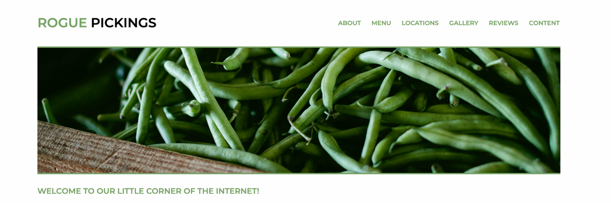

# Rogue Pickings site

A clean, minimalist site for a "fresh food" restaurant truck business, complete with information about locations, menus, and reviews from satisfied customers! It was crafted using our good ole' friends HTML & CSS from a comp provided by a web designer.

## Prerequisites

- A simple, up-to-date browser than can read and display HTML5 & CSS is all that's needed. 🤓

This is a student project for display only, thanks!

```
It was created using Skillcrush.com coursework: <https://github.com/skillcrush>
```

## Contributors

The following contributed to this project:

- [Skillcrush.com](http://skillcrush.com/) coursework: [https://github.com/skillcrush](https://github.com/skillcrush)
- [@victoria-farr](https://github.com/Victoria-Farr) 🍊

## Contact

If you want to contact me you can reach me at [victoriafarr@gmail.com](mailto:victoriafarr@gmail.com)

## License

This project uses the following license: [Attribution-NonCommercial-NoDerivatives 4.0 International (CC BY-NC-ND 4.0)](https://creativecommons.org/licenses/by-nc-nd/4.0/).
